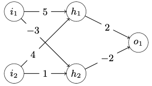

# Task 2. Backpropagation (6 points)

Given the following neural network:

## a) Calculate the output for the following inputs i1 = 5 and i2 = 2. The output function is the identity function. (0.5
P.)

$$net_{h_1} = i_1 * 5 + i_2 * 4 = 25 + 8 = 33$$
$$net_{h_2} = i_1 * -3 + i_2 * 1 = -15 + 2 = -13$$
$$out_{o_1} = h_1 * 2 + h_2 * -2 = 66 + 26 = 92$$

## b) Calculate the error (MSE) for the input from part a). The actual output for the input is 100 (0.5 P.)

$$MSE = (92-100)^2 = 64$$

## c) Apply the Backpropagation algorithm once and update all weights of the network. Use a learning rate of 0.0005. Calculate the output and error again for the input from part a). (4 P.)

$w_i$ is the $i$-th weight reading left to right, top to bottom

Initial:
$$w_1 = 5,
w_2 = -3,
w_3 = 4,
w_4 = 1,
w_5 = 2,
w_6 = -2$$

Calculation:
$$w_i'=wi-\eta\frac{\delta E}{\delta w_i}=w_i-\eta\frac{\delta E}{\delta p}*\frac{\delta p}{\delta wi}$$
$$\eta = 0.0005,
p = 92,
a = 100,
E = \frac{1}{2}(p-a)^2$$

### Calculate $w_i'$ layer by layer backwards

#### Output Node
$$\frac{\delta}{\delta p}E*\frac{\delta}{\delta w_6}p
=\left[\frac{\delta}{\delta p}(p-a)^2\right]*\left[\frac{\delta}{\delta w_6}h_1*w_5+h_2*w_6\right]
=2*(p-a)*\frac{\delta}{\delta p}(p-a)*h_2
=2*(p-a)*h_2
\overset{\Delta=p-a}{=} 2\Delta h_2$$
$$\implies w_6'=w_6-n*2\Delta h_2 =-2-.0005*2*-8*-13=-2.104$$
Analogue $w_5$
$$\implies w_5'=w_5-\eta*\Delta*h_1 =2-.0005*-8*33=2.264$$
#### Hidden Nodes
$$\frac{\delta}{\delta p}E*\frac{\delta}{\delta w_4}p
=\frac{\delta}{\delta p}E*\frac{\delta}{\delta h_2}p*\frac{\delta}{\delta w_4}h_2
=\frac{\delta}{\delta p}(p-a)^2
*\frac{\delta}{\delta h_2}\left(h_1*w_5+h_2*w_6\right)
*\frac{\delta}{\delta w_4}\left(i_1*w_2+i_2*w_4\right)
=2(p-a)*w_6*i_2
\overset{\Delta=p-a}{=} 2\Delta w_6i_2$$
$$\implies w_4'=w_4-\eta*2\Delta w_6i_2 =1-.0005*2*-8*-2*2=0.968$$
Analogue $w_3$ to $w_1$
$$\implies w_3'=w_3-\eta*2\Delta w_5i_2 =4-.0005*2*-8*2*2=4.032$$
$$\implies w_2'=w_2-\eta*2\Delta w_6i_1 =-3-.0005*2*-8*-2*5=-3.080$$
$$\implies w_1'=w_1-\eta*2\Delta w_5i_1 =5-.0005*2*-8*2*5=5.080$$
$$\implies
w_1' = 5.080,
w_2' = -3.080,
w_3' = 4.032
w_4' = 0.968,
w_5' = 2.264,
w_6' = -2.104$$
## d) How would your result change if you increased or decreased the learning rate by a factor of 10? (0.5 P.)

The increase or decrease of each new weight would increase or decrease by a factor of 10.
$$\eta = .00005: 
w_1' = 5.0080,
w_2' = -3.0080,
w_3' = 4.0032
w_4' = 0.0968,
w_5' = 2.0264,
w_6' = -2.0104$$
$$\eta = .005: 
w_1' = 5.80,
w_2' = -3.80,
w_3' = 4.32
w_4' = 0.78,
w_5' = 4.64,
w_6' = -3.04$$
As we can see, the smaller learning rate simply adds a 0 after the comma. The bigger one massively influenced the weights connected to the output. If we have lots of data, it would cause huge fluctuations, with an epoch.
## e) What would happen if you initialized all weights with 0? (0.5 P.)
Then they would stay at 0, since each new weight is multiplicatively dependent on the weights of the previous iteration.